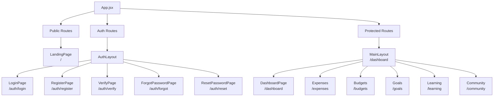
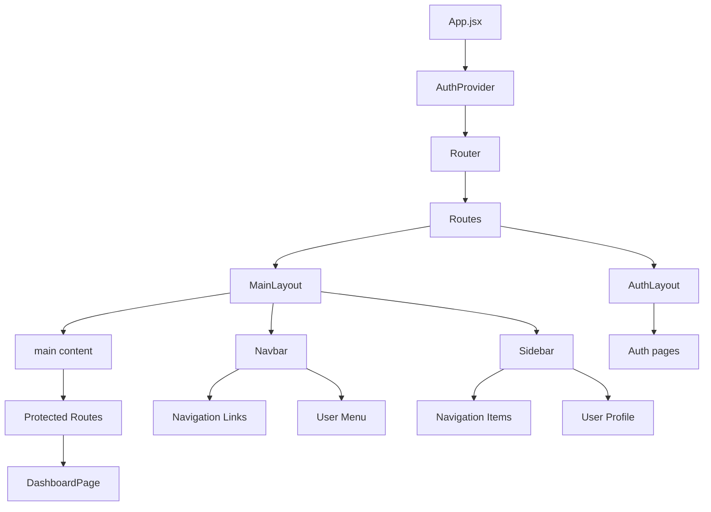

# FinWise Frontend Sitemap

## Page Hierarchy and Routes

## Component Hierarchy

## Key Components

1. **Layouts**
   - MainLayout.jsx - Main application layout with Navbar and Sidebar
   - AuthLayout.jsx - Layout for authentication pages

2. **Pages**
   - LandingPage.jsx - Home page for unauthenticated users
   - LoginPage.jsx - User login page
   - RegisterPage.jsx - User registration page
   - VerifyPage.jsx - Email verification page
   - ForgotPasswordPage.jsx - Password reset request page
   - ResetPasswordPage.jsx - Password reset page
   - DashboardPage.jsx - Main dashboard for authenticated users

3. **Components**
   - Navbar.jsx - Top navigation bar
   - Sidebar.jsx - Side navigation menu
   - FormInput.jsx - Reusable form input component
   - Button.jsx - Reusable button component
   - Card.jsx - Reusable card component
   - LoadingSpinner.jsx - Loading indicator
   - ErrorBanner.jsx - Error display component
   - ProtectedRoute.jsx - Route protection component

4. **Contexts**
   - AuthContext.jsx - Authentication state management

5. **Utilities**
   - api.js - Axios instance with interceptors

## Styling

- Tailwind CSS for utility-first styling
- Custom CSS variables for consistent theming
- Responsive design for mobile and desktop
- Gradient backgrounds and modern UI elements